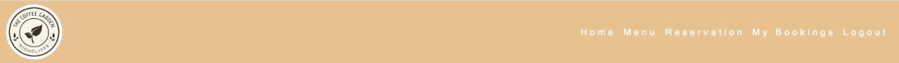

# Project Portfolio 4 Full Stack Frameworks - The Coffee Garden

The Coffee Garden project portfolio has been created for educational purposes only as the 4th project in the Code Institute’s full stack development program.

Using the principles of UX design and the agile development methodology, this project was developed using HTML, CSS, JavaScript, Python and the Django framework.

## Live Site

You can view the live deployed game here: <a href="https://the-coffee-garden.herokuapp.com/" target="_blank"> The Coffee Garden </a>

# Contents

* [Objective](<#objective>)
* [User Experience](<#user-experience-ux>)
* [Agile Methodology](#agile-methodology)
* [User Stories](#user-stories)
* [Design](#design)
* [Database Schema](#database-schema)
* [The Coffe Garden Flow Chart](<#the-coffee-garden-flow-chart>)
* [Features](#features)
* [Future Features](<#future-features>)
* [Technologies Used](#technologies-used)
* [Testing](<#testing>)
  * [Bugs Fixed](#bugs-fixed)
* [Deployment](#deployment)
* [Credits](<#credits>)
* [Acknowledgements](<#acknowledgements>)

# Objective

The Coffee Garden is a small restaurant that lacks an online presence and would like to increase the engagement with its customers and potential customers through an online platform. As such they have identified the following areas of opportunity:

   * Create an online presence
   * Interact with current/potential customers
   * Create an online reservation system
   * Display key information
   * Create marketing opportunities through the social media links displayed in the site

[Back to top](<#contents>)

# User Experience (UX)

-   ### Site Aims  
  The overall goal of this project is to create a restaurant webpage that is visually nice and easy to navigate to the user. Visitors should be able to find general information about the restaurant in the home page, as well as finding the menu offerings. In addition, visitors should be able to make a reservation for a table directly on the webpage. It will also provide a booking management admin panel for the restaurant owner.

## Agile Methodology

The principles of agile methodology were utilized during the project. By assigning user stories to issues and taking advantage of the GitHub Kanban board functionality, the necessary goals and priorities throughout the project could be well defined. In addition, labels were used to further define the priority of eacn user story in the Kanban board.

[Back to top](<#contents>)

## User Stories

  -   #### First Time Visitor Goals
        - As a first time visitor, the user can read and learn about the restaurant, it's location, social media involment and get a feel for this place.
        - As a first time visitor, the user can find out what kind of food they serve from their menu.
        - As a first time visitor, the user can find information about how to make a reservation at the restaurant.
        
  -   #### Returning Visitor Goals
        -  As a returning visitor, the user can create an account so I can make an online reservation.
        -  As a returning visitor, the user can login and find my current bookings.
        -  As a returning visitor, the user can update or cancel a booking once they login to the site.
        -  As a returning visitor, the user can check the menu to see if has changed.

-    #### Admin Stories
        - As a site admin I could add, update, cancel existing boookings made in my website.
        - As a site admin I could add, update, delete users registered on my website.
        - As a site admin I could check all the accounts registered on my website.

[Back to top](<#contents>)

## Design

The theme for the project were chosen in accordance with the intended target market in mind for the restaurant. It primarely focus on attracting families, young crows, local residents, and visitors to this region.
    
- Colors  
The main colors are overall cream-pastel, it blends well with the main product that this restaurant has to offer; the best coffe in town.
- Font  
The fonts in the theme are clear and modern and contribute perfectly to the overall look of the site.  
- Images  
The images in the theme provide great content to the site; as the user navegates through the pages; reasures him/her the type of products are being served here.

[Back to top](<#contents>)

# Database Schema
- The database design schema can be viewed below. It consists of a Booking model with a foreignKey of User that relates to the Django standard User model class.  

[Back to top](<#contents>)

# The Coffe Garden Flow Chart

[Back to top](<#contents>)

# Features

My project consists of nine webpages:

- Home or landing page.
- Menu page.
- Reservation page.
- Register page.
- Login page.
- Book a Table (Reservation Page).
- Booking confirmation page.
- My Bookings page.
- Logout page.

### The Navigation Bar  
- The navigation bar shows all the sections that the user can enter and provides a quick and easy means of navigating the site.
- The navigation bar bar is very responsive and user friendly, it has an additional hover effect to help the user with his/her selection.
- The restaurant logo located on the the left hand corner of the navigation bar, helps the user to go back to the home page by clicking on it.

[Back to top](<#contents>)

## Future Features

[Back to top](<#contents>)

## Technologies Used

[Back to top](<#contents>)

# Testing

I have included testing details in a separate document called [Testing.md](testing.md)

[Back to top](<#contents>)

## Bugs Fixed

[Back to top](<#contents>)

## Deployment

[Back to top](<#contents>)

## Credits

[Back to top](<#contents>)

## Acknowledgements

[Back to top](<#contents>)

