# Testing  

## Methodology  
Testing was done throughout the process while developing the project by the use of Django debug pages. In addition all code has been validated with different online tools as presented below.

* ## Html Code Validator
    * All the HTML pages code ran through [html code validator](https://validator.w3.org/#validate_by_uri) and there were no issues found.
        

* ## CSS Code Validator
    * All the CSS code ran through using [css code validator](https://validator.w3.org/#validate_by_input) and there were no issues found.

There was however an error, and some warnings issues regarding the use of css variables that it could not validate, this only happened when I validated the code by URI.

The following warnings messages were fixed for HTML and CSS while validating my code:

* #### HTML

* #### CSS

* ## Javascript Code Validator
    * Using [jshint](https://jshint.com/), I ran my jquery/javascript code and found no errors.

* ## Python Validation

    * All Python code was validated using CI Python Linter [https://pep8ci.herokuapp.com/](https://pep8ci.herokuapp.com/) and the following indentation errors were found and fixed accordingly.

manage.py

models.py

views.py

* ## Lighthouse Testing
    * All pages were checked on lighthouse with average results of 88% and 97% for each page on desktop, and an average of 72% and 100% for each page on mobile devices.
    Performance was impacted on a few pages, especially on mobile devices. Similar to the warnings with CSS validation above, the performance issues are related to the third-party library used in my project; I could have compressed further the background images to improve performance, but due to time constraints I couldn't tackle this; I will defefitenely bear this in mind for my next project.

### Home Page

#### **Desktop**

#### **Mobile**

### Menu Page

#### **Desktop**

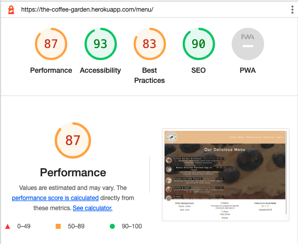

#### **Mobile**

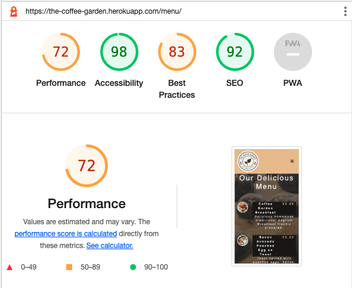

### Reservation Page

#### **Desktop**

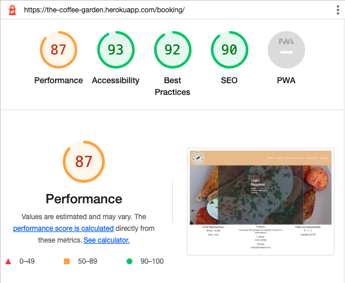

#### **Mobile**

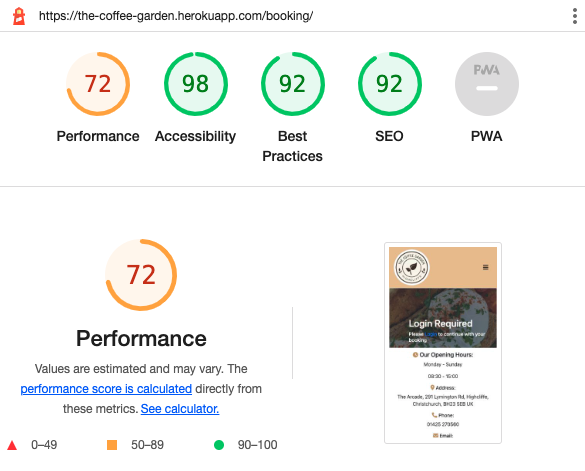

### Register Page

#### **Desktop**

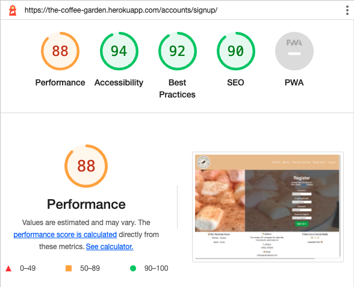

#### **Mobile**

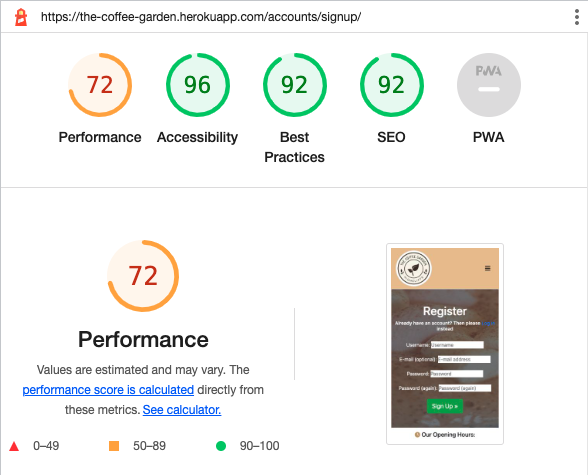

### Login Page

#### **Desktop**

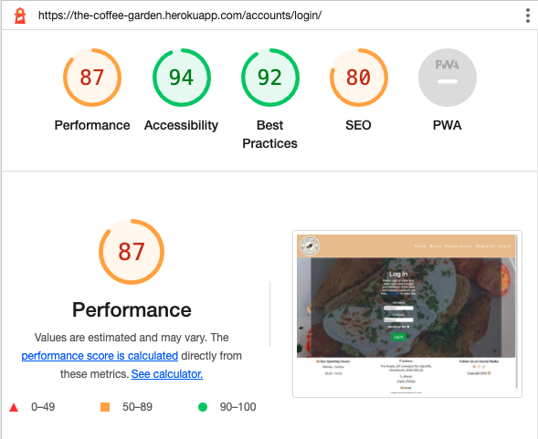

#### **Mobile**

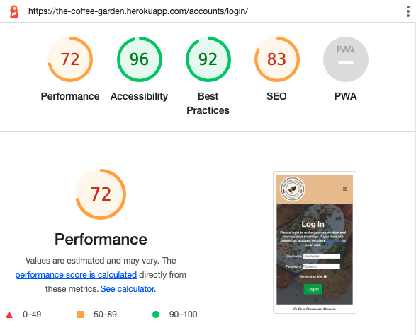

### Book a Table Page

#### **Desktop**

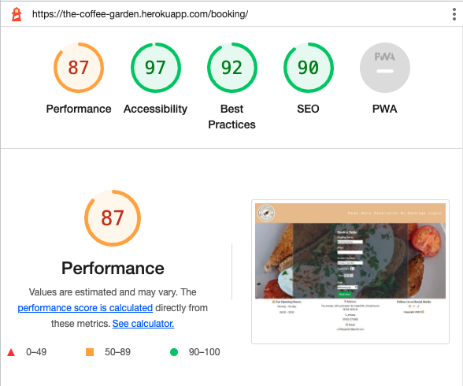

#### **Mobile**

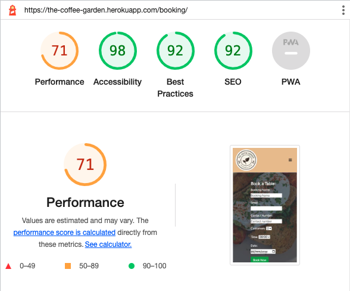

### Booking Confirmation Page

#### **Desktop**

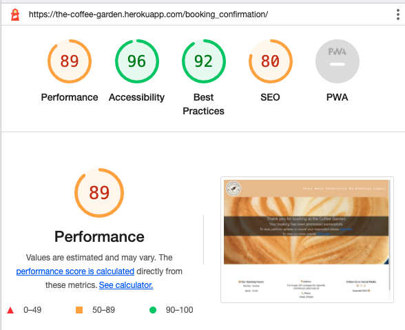

#### **Mobile**

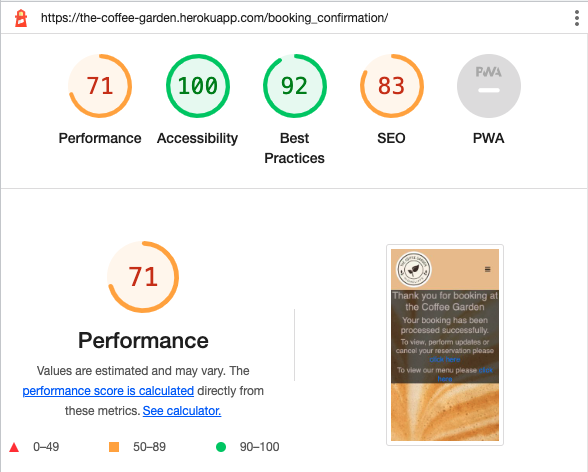

### My Bookings Page

#### **Desktop**

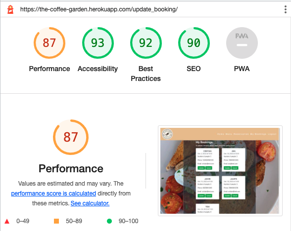

#### **Mobile**

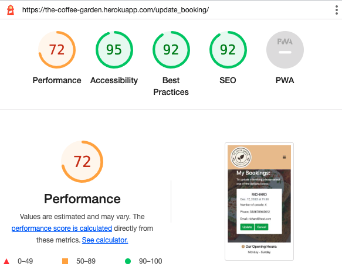

### Log Out Page

#### **Desktop**

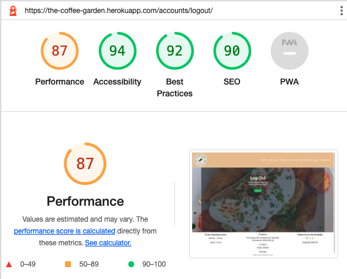

#### **Mobile**

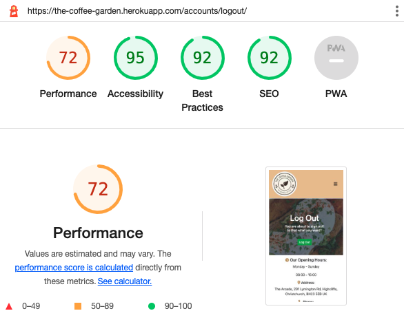