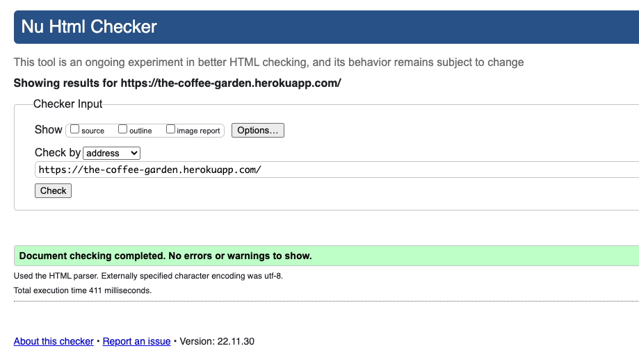
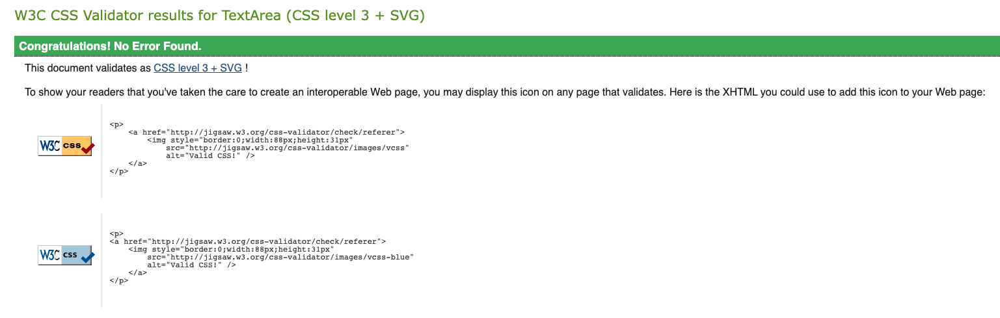
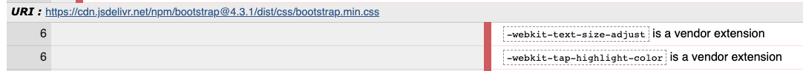
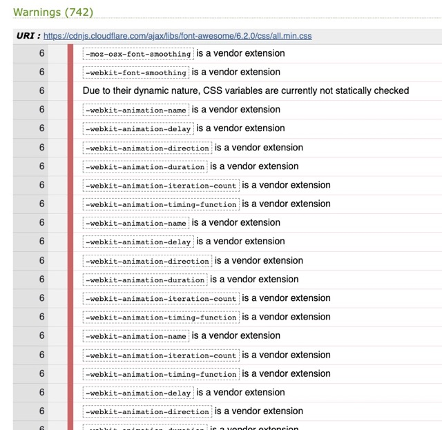
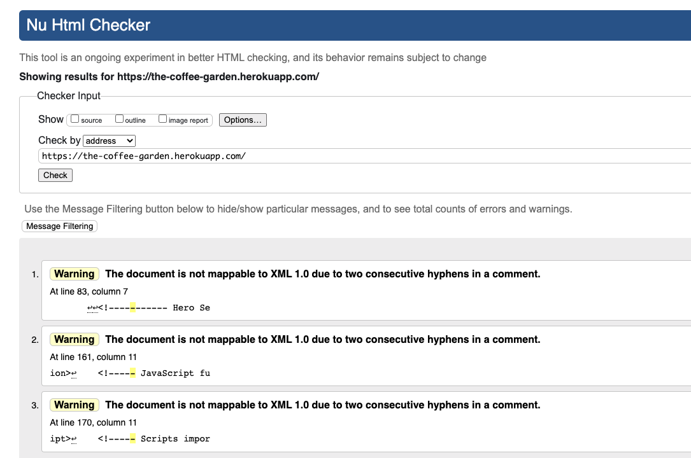
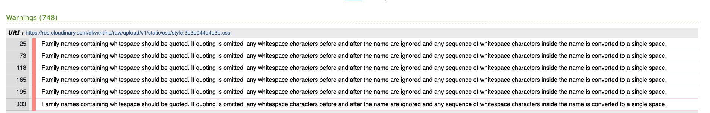
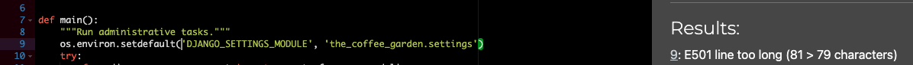
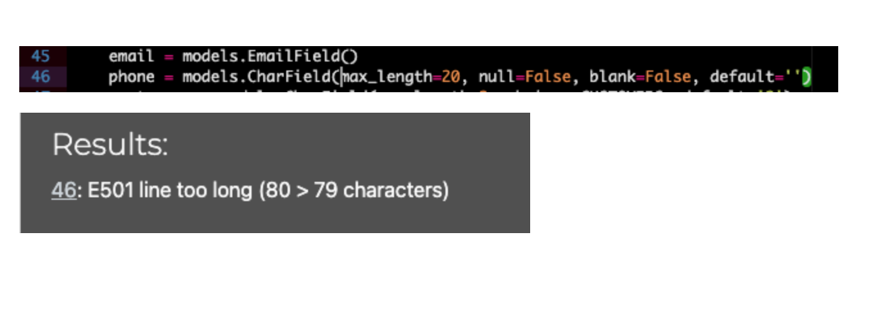
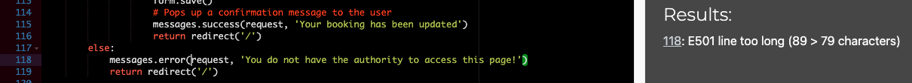

# Testing  

## Methodology  
Testing was done throughout the process while developing the project by the use of Django debug pages. In addition all code has been validated with different online tools as presented below.

* ### Html Code Validator
    * All the HTML pages code ran through [html code validator](https://validator.w3.org/#validate_by_uri) and there were no issues found.
        

* ### CSS Code Validator
    * All the CSS code ran through using [css code validator](https://validator.w3.org/#validate_by_input) and there were no issues found.

There was however an error, and some warnings issues regarding the use of css variables that it could not validate, this only happened when I validated the code by URI.

The following warnings messages were fixed for html and css while validating my code:

* #### HTML

* #### CSS

* ### Javascript Code Validator
    * Using [jshint](https://jshint.com/), I ran my jquery/javascript code and found no errors.

* ### Python Validation

    * All Python code was validated using CI Python Linter [https://pep8ci.herokuapp.com/](https://pep8ci.herokuapp.com/) and the following indentation errors were found and fixed accordingly.

manage.py

models.py

views.py

* ### Lighthouse Testing
    * All pages were checked on lighthouse with the results between % and % for each page on mobile and desktop.